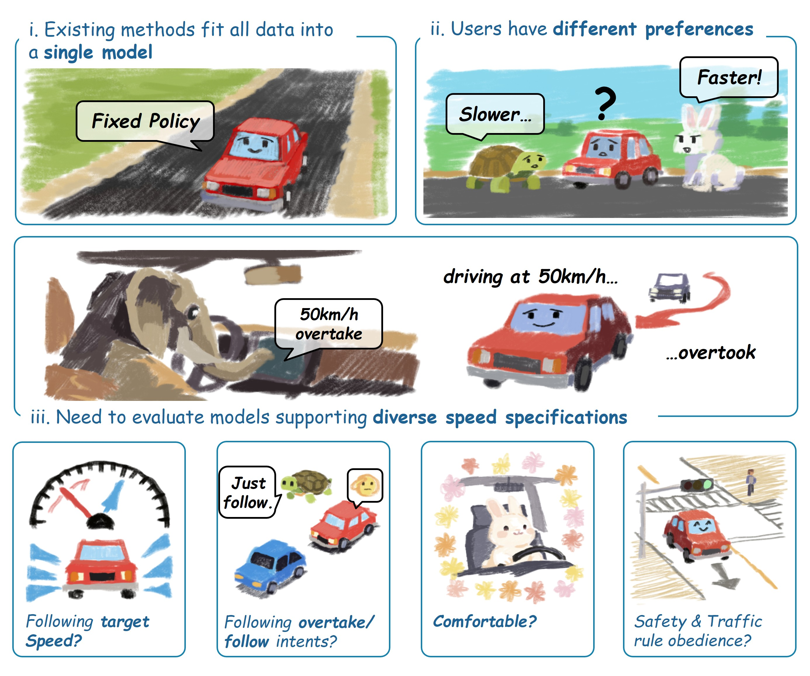
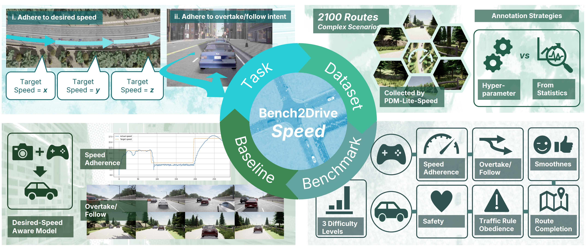
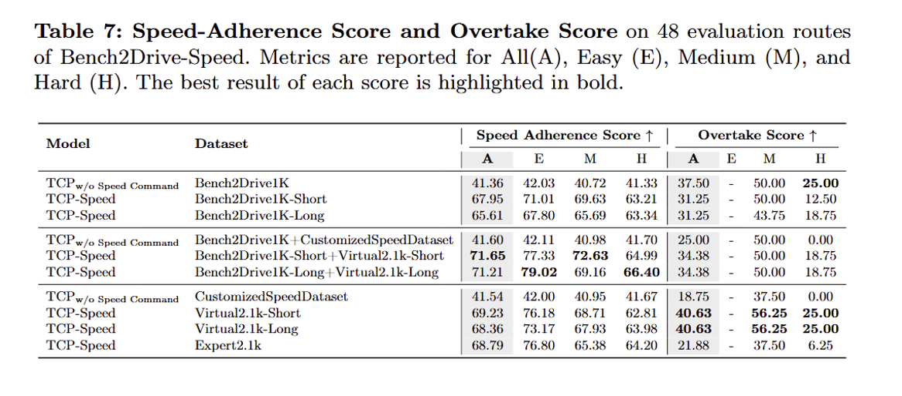
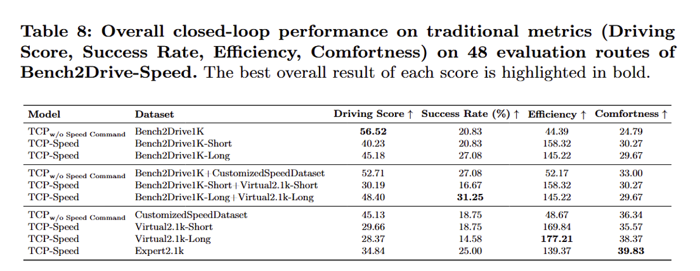

<p align="center">
  
</p>

<h1 align="center">
  <b>Bench2Drive-</b><b><i><span style="color:#0969da;">Speed</span></i></b>
</h1>

<p align="center">
  <i>Benchmark and Baselines for Desired-Speed Conditioned Autonomous Driving</i>
</p>

<p align="center">
  <a href="https://huggingface.co/datasets/rethinklab/Bench2Drive-Speed">📁 Dataset</a> |
  <a href="https://huggingface.co/rethinklab/TCP-Speed">🤖 Baseline</a>
</p>

<p align="center">
<b>Bench2Drive-Speed</b> is a <b>closed-loop benchmark for desired-speed conditioned autonomous driving</b>, enabling explicit control over vehicle behavior through <b>target speed</b> and <b>overtake/follow commands</b>.
</p>

## ✨ Overview

End-to-end autonomous driving (E2E-AD) systems have achieved strong performance, but **lack explicit controllability** over user preferences such as:

* Desired driving speed
* Whether to overtake or follow other vehicles

**Bench2Drive-Speed** fills this gap by introducing:

* 🎯 **Target-speed conditioning**
* 🚘 **Overtake / Follow commands**
* 📊 **Quantitative controllability metrics**
* 🔁 **Closed-loop evaluation benchmark**

<p align="center">
  
</p>

---

## 📑 Table of Contents

- [✨ Overview](#-overview)
- [📦 Dataset](#-dataset)
- [⚙️ Setup](#️-setup)
- [📊 Evaluate](#-evaluate)
- [🔧 Training Baseline](#-training-baseline)
- [📈 Benchmark](#-benchmark)
- [📝 License](#-license)
- [📜 Citation](#-citation)

---

## 📦 Dataset

**Bench2Drive-Speed's CustomizedSpeedDataset** contains **2,100 CARLA driving scenarios** with expert demonstrations and annotated **overtake/follow commands**.  
The released dataset includes **expert target-speed signals only**.

🔗 Download:
- 🤗 Huggingface: https://huggingface.co/datasets/rethinklab/Bench2Drive-Speed

If you downloaded this, don't forget to extract the tar.gz archive.

#### ⚙️ Virtual Target Speed Annotation

You can use a script to generate **virtual target speed** from Bench2Drive-style driving dataset.

1. Find `tools/append_virtual_target_speed.py`

2. Set the path to your dataset in the main function.

    ```python
    # ======================
    # entry
    # ======================
    if __name__ == "__main__":
        main(
            ["/path/to/dataset"] # << modify here
        )
    ```

3. Set hyperparameters. In our paper's setting, 

  - Short: `MAX_EXTEND = 3.0 TIME_MAX = 1.5`

  - Long: `MAX_EXTEND = 10.0 TIME_MAX = 3.0`

4. Run the script.

    ```bash
    python tools/append_virtual_target_speed.py
    ```

## ⚙️ Setup

For carla setup, please refer to [Bench2Drive repo](tools/append_virtual_target_speed.py).

To create a new agent, please refer to [tcp_b2d_speed_agent.py](./TCP/team_code/tcp_b2d_speed_agent.py), which implements an agent that inherits from [autonomous_agent.AutonomousAgent](./Bench2Drive/leaderboard/leaderboard/autoagents/autonomous_agent.py).

In addition to the default CARLA autonomous driving agents, you can use `self.get_planned_speed()` to obtain the current target speed as a float (km/h). You can also use `self.do_overtake` to access the current overtaking command as a boolean.

## 📊 Evaluate

  - Add your agent to leaderboard/team_code/your_agent.py & Link your model folder under the Bench2Drive directory.
    ```bash
    Bench2Drive\ 
      assets\
      docs\
      leaderboard\
        team_code\
          --> Please add your agent HERE
      scenario_runner\
      tools\
      --> Please link your model folder HERE
    ```
  
  - To do the evaluation, please write a start up script like this under `Bench2Drive/leaderboard/scripts` ([this one](./Bench2Drive/leaderboard/scripts/run_evaluation_tcp_speed) is wrote for TCP-Speed):
    ```bash
    #!/bin/bash
    BASE_PORT=30000 # CARLA Simulator's port
    BASE_TM_PORT=50000 # Traffic manager's port
    IS_BENCH2DRIVE=True # Please set this to true
    BASE_ROUTES=leaderboard/data/b2dspd_eval48 # Path to the evaluation route json
    TEAM_AGENT=leaderboard/team_code/your_agent.py # Path to your agent
    TEAM_CONFIG=your_team_agent_ckpt.ckpt # Path to your config.
    # Agents like uniad/vad's configuration might different from this one
    # please refer to Bench2Drive repo.
    BASE_CHECKPOINT_ENDPOINT=checkpoint_name # Path to the json file which records evaluation result and progress

    SAVE_PATH=output # The directory where sensor output and data used for metrics are saved 
    PLANNER_TYPE=only_traj # Only for TCP, you can delete this line

    GPU_RANK=2 # The gpu you want CARLA to run on.
    # Notably, CARLA ranks gpu according to vulkan,
    # so it might not match the index in nvidia-smi. 
    CUDA_VISIBLE_DEVICES=2 # The gpu you want your model to run on.
    PORT=$BASE_PORT
    TM_PORT=$BASE_TM_PORT
    ROUTES="${BASE_ROUTES}.xml"
    CHECKPOINT_ENDPOINT="${BASE_CHECKPOINT_ENDPOINT}.json"
    export CLEAR_LANE=1 # Make sure this environ is set!
    bash leaderboard/scripts/run_evaluation.sh $PORT $TM_PORT $IS_BENCH2DRIVE $ROUTES $TEAM_AGENT $TEAM_CONFIG $CHECKPOINT_ENDPOINT $SAVE_PATH $PLANNER_TYPE $GPU_RANK
    ```

  - Start the evaluation:
    ```bash
    cd Bench2Drive/
    # Verify the correctness of the team agent, need to set GPU_RANK, TEAM_AGENT, TEAM_CONFIG
    bash leaderboard/scripts/run_evaluation_tcp_speed.sh
    # or execute your custom startup script if you have defined one.
    ```

    You can modify this script to adapt your agent.

  - Metric: **Make sure there are exactly 48 routes in your json. Failed/Crashed status is also acceptable. Otherwise, the metric is inaccurate.**

    When using the scripts below, remember to modify the directory parameters to yours.

    ```bash
    # Get Speed-Adherence
    python tools/speed_metric_new.py
    # This script will generate speed adherence score and visualized speed curves.

    # Get Driving Score and Success Rate
    python tools/metric_stats_48.py
    # This script will generate three files:
    # 1. {output_name}_with_overtake.json, 
    #    in which the overtake/follow infraction is recorded
    #    and calculated as x0.7 penalty;
    # 2. {output_name}_traditional.json,
    #    in which the overtake/follow infraction does not count;
    # 3. {output_name}_statistic.json,
    #    in which only evaluation results are recorded, 
    #    excluding detailed infractions

    # Get Overtake Score
    python tools/overtake_score.py
    # This script will generate overtake score

    # Get multi-ability results
    python tools/ability_benchmark_offline.py -r {output_name}_traditional.json

    # Get driving efficiency and driving smoothness results
    python tools/efficiency_smoothness_benchmark.py -f {output_name}_traditional.json -m your_metric_folder/
    ```

## 🔧 Training Baseline

🔗 You can download baseline checkpoints to avoid training from scratch:
- 🤗 Huggingface: https://huggingface.co/rethinklab/TCP-Speed

1. Preprocess data

    ```bash
    cd TCP
    # need set YOUR_Data_PATH
    python tools/gen_tcp_data_local.py
    # this script will generate dataset with target speed and virtual target speed
    ```

2. Training: using expert demonstration

    ```bash
    cd TCP
    bash TCP/train_speed.sh
    ```

3. Training: using virtual target speed (make sure they are annotated! see [Virtual Target Speed Annotation](#-dataset))

    ```bash
    cd TCP
    bash TCP/train_speed_virtual.sh
    ```

## 📈 Benchmark

<p align="center">
  
  
</p>

## 📝 License
All assets and code are under the CC-BY-NC-ND unless specified otherwise.


---
